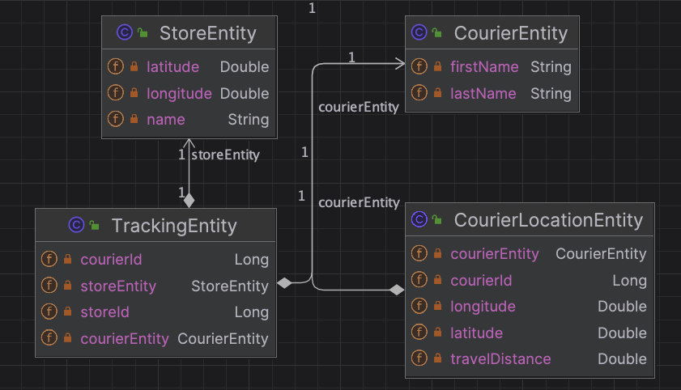

## Courier Tracking Project

**Project Goal**

**The project aims to develop a RESTFUL web application in Java that processes streaming geolocations of couriers. It includes functionalities such as logging and storing entries when couriers enter a 100-meter radius of Migros stores, preventing reentries within 1 minute, and providing a method to query total travel distances for any courier. Additionally, the project incorporates the implementation of at least two design patterns for improved code structure and maintainability**

**Project Tech Stack**
<b>
- Project was written by Java 21 and Spring Boot v3.2.1 Environments
- Observer Pattern with Spring Boot Application Event
- Strategy Pattern
- H2 DB
- Lombok
- Open Api
- Docker
  </b>

**Endpoints**

There are 4 endpoints in the project.

1. **POST /v1/stores** for creating store
2. **POST /v1/couriers** for creating courier
3. **POST /v1/courier-locations** for creating courier location
4. **GET /v1/courier-locations** for getting total travel distance

**Run with Docker**
- Compile project with Java 21
- Run with Docker commands, go to project folder and run this commands

  ```
    $ cd courier-tracking
    $ mvn clean install
    $ docker build -t courier-tracking-image . 
    $ docker-compose -f docker-compose.yaml up -d
  ```

**Run with IDE**
- Add your host file
  ```
    0.0.0.0 courier-tracking
  ```  

**Usage of The Project**
1. **When starting application, stores are initialized**
2. **Creating store(optional)**
2. **Create courier**
3. **Create courier location**
4. **Get total travel distance**

1. **Postman Collection is added to doc directory**
2. **Swagger is added with http://0.0.0.0:8080/swagger-ui.html** 
3. **Curl Commands**

  ```
  curl --location 'http://0.0.0.0:8080/v1/stores' \
--header 'Content-Type: application/json' \
--header 'Accept: */*' \
--data '{
  "latitude": 41.01170059994747,
  "longitude": 29.193239602430044,
  "name": "Sancaktepe MM Migros"
}'
  ```

  ```
  curl --location 'http://0.0.0.0:8080/v1/couriers' \
--header 'Content-Type: application/json' \
--header 'Accept: */*' \
--data '{
  "firstName": "courier-firstname",
  "lastName": "courier-lastname"
}'
  ```

  ```
  curl --location 'http://0.0.0.0:8080/v1/courier-locations?courierId=1' \
--header 'Content-Type: application/json' \
--header 'Accept: */*' \
--data '{
  "latitude": 41.055783,
  "longitude": 29.0210292
}'
  ```

  ```
  curl --location 'http://0.0.0.0:8080/v1/courier-locations?courierId=1' \
--header 'Accept: */*'
  ```

***DATABASE***



